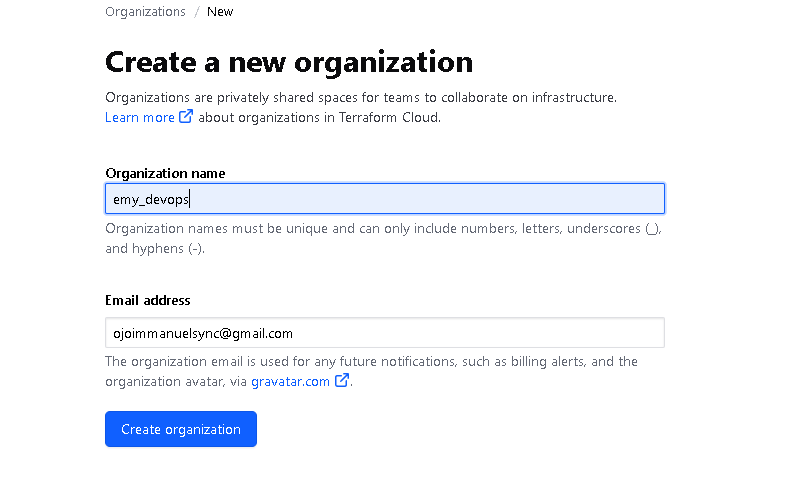
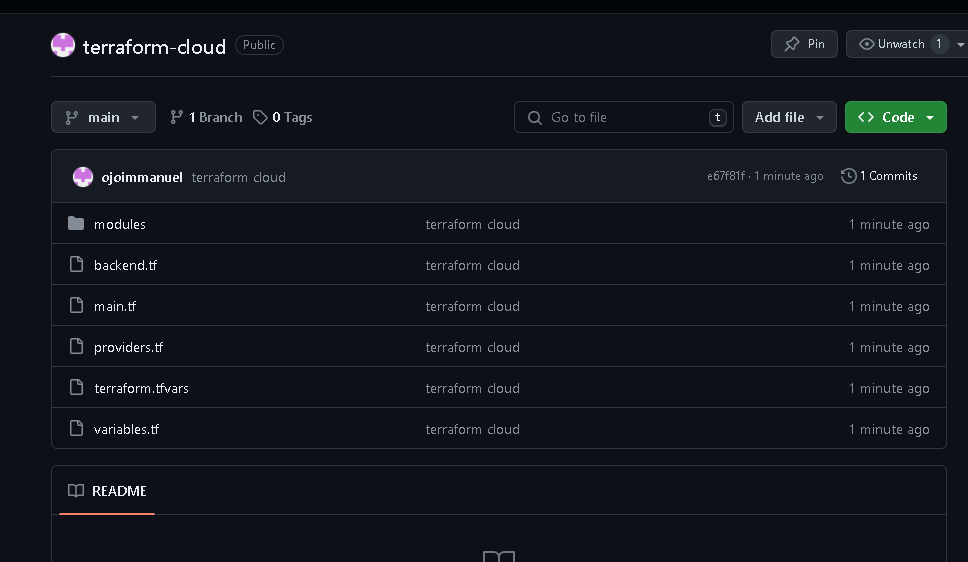
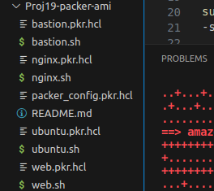
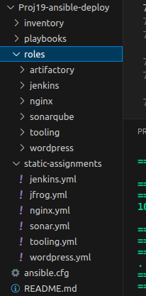
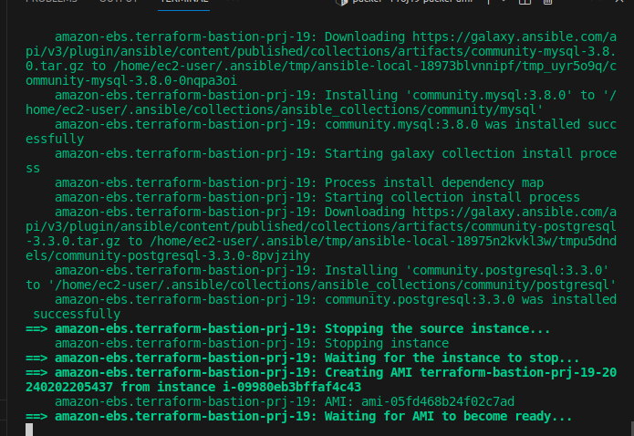
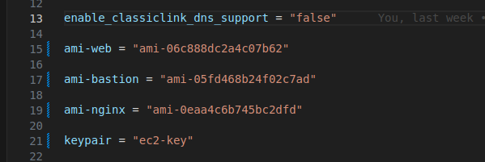
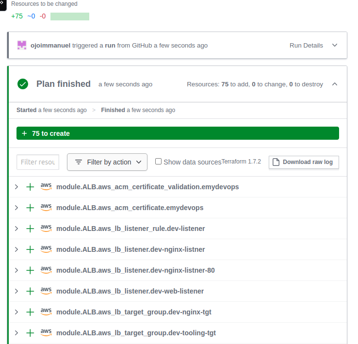

# Automate Infrastructure With IaC using Terraform. Part 4 - Terraform Cloud

### What Terraform Cloud is and why use it

By now, you should be pretty comfortable writing Terraform code to provision Cloud infrastructure using [Configuration Language (HCL)](https://www.terraform.io/docs/language/). Terraform is an open-source system, that you installed and ran a Virtual Machine (VM) that you had to create, maintain and keep up to date. In Cloud world it is quite common to provide a managed version of an open-source software. Managed means that you do not have to install, configure and maintain it yourself - you just create an account and use it "as A Service". 

[Terraform Cloud](https://www.terraform.io/cloud) is a managed service that provides you with Terraform CLI to provision infrastructure, either on demand or in response to various events. 

By default, Terraform CLI performs operation on the server whene it is invoked, it is perfectly fine if you have a dedicated role who can launch it, but if you have a team who works with Terraform - you need a consistent remote environment with remote workflow and shared state to run Terraform commands.

Terraform Cloud executes Terraform commands on disposable virtual machines, this remote execution is also called [remote operations](https://www.terraform.io/docs/cloud/run/index.html).

#### Instructions On How To Submit Your Work For Review And Feedback

To submit your work for review and feedback - follow [**this instruction**](https://starter-pbl.darey.io/en/latest/submission.html).

### Migrate your `.tf` codes to Terraform Cloud

Le us explore how we can migrate our codes to Terraform Cloud and manage our AWS infrastructure from there:

1. Create a Terraform Cloud account

Follow [this link](https://app.terraform.io/signup/account), create a new account, verify your email and you are ready to start

Most of the features are free, but if you want to explore the difference between free and paid plans - you can check it on [this page](https://www.hashicorp.com/products/terraform/pricing).

2. Create an organization

Select "Start from  scratch", choose a name for your organization and create it.

3. Configure a workspace

Before we begin to configure our workspace - watch [this part of the video](https://youtu.be/m3PlM4erixY?t=287) to better understand the difference between `version control workflow`, `CLI-driven workflow` and `API-driven workflow` and other configurations that we are going to implement.

We will use `version control workflow` as the most common and recommended way to run Terraform commands triggered from our git repository.

Create a new repository in your GitHub and call it `terraform-cloud`, push your Terraform codes developed in the previous projects to the repository.

Choose `version control workflow` and you will be promped to connect your GitHub account to your workspace - follow the prompt and add your newly created repository to the workspace.

Move on to "Configure settings", provide a description for your workspace and leave all the rest settings default, click "Create workspace".

4. Configure variables

Terraform Cloud supports two types of variables: environment variables and Terraform variables. Either type can be marked as sensitive, which prevents them from being displayed in the Terraform Cloud web UI and makes them write-only.

Set two environment variables: `AWS_ACCESS_KEY_ID` and `AWS_SECRET_ACCESS_KEY`, set the values that you used in [Project 16](https://expert-pbl.darey.io/en/latest/project16.html). These credentials will be used to privision your AWS infrastructure by Terraform Cloud.

After you have set these 2 environment variables - yout Terraform Cloud is all set to apply the codes from GitHub and create all necessary AWS resources.

5. Now it is time to run our Terrafrom scripts, but in our previous project which was [project 18](https://www.darey.io/docs/automate-infrastructure-with-iac-using-terraform-part-3-refactoring/), we talked about using Packer to build our images, and Ansible to configure the infrastructure, so for that we are going to make few changes to  our existing [respository](https://github.com/darey-devops/PBL-project-18.git) from Project 18.

The files that would be Addedd is;
- AMI: for building packer images
- Ansible: for Ansible scripts to configure the infrastucture

Before you proceed ensure you have the following tools installed on your local machine;

- [packer](https://learn.hashicorp.com/tutorials/packer/get-started-install-cli)
- [Ansible](https://docs.ansible.com/ansible/latest/installation_guide/intro_installation.html)

Refer to this [repository](https://github.com/darey-devops/PBL-project-19.git) for guidiance on how to refactor your enviroment to meet the new changes above and ensure you go through the `README.md` file.

6. Run `terraform plan` and `terraform apply` from web console

Switch to "Runs" tab and click on "Queue plan manualy" button. If planning has been successfull, you can proceed and confirm Apply - press "Confirm and apply", provide a comment and "Confirm plan"

Check the logs and verify that everything has run correctly. Note that Terraform Cloud has generated a unique state version that you can open and see the codes applied and the changes made since the last run.

7. Test automated `terraform plan`

By now, you have tried to launch plan and apply manually from Terraform Cloud web console. But since we have an integration with GitHub, the process can be triggered automatically. Try to change something in any of `.tf` files and look at "Runs" tab again - `plan` must be launched automatically, but to `apply` you still need to approve manually. Since provisioning of new Cloud resources might incur significant costs. Even though you can configure "Auto apply", it is always a good idea to verify your `plan` results before pushing it to `apply` to avoid any misconfigurations that can cause 'bill shock'.

**Note:** First, try to approach this project on your own, but if you hit any blocker and could not move forward with the project, refer to [this video](https://youtu.be/nCemvjcKuIA)

#### Practice Task №1

1. Configure 3 branches in your `terraform-cloud` repository for `dev`, `test`, `prod` environments
2. Make necessary configuration to trigger runs automatically only for `dev` environment
2. Create an Email and Slack notifications for certain events (e.g. started `plan` or errored run) and test it
3. Apply `destroy` from Terraform Cloud web console

### Public Module Registry vs Private Module Registry

Terraform has a quite strong community of contributors (individual developers and 3rd party companies) that along with HashiCorp maintain a [Public Registry](https://www.terraform.io/docs/registry/index.html), where you can find reusable configuration packages ([modules](https://www.terraform.io/docs/registry/modules/use.html)). We strongly encourage you to explore modules shared to the public registry, specifically for this project - you can check out [this AWS provider registy page](https://registry.terraform.io/modules/terraform-aws-modules/vpc/aws/latest). 

As your Terraform code base grows, your DevOps team might want to create you own library of reusable components - [Private Registry](https://www.terraform.io/docs/registry/private.html) can help with that.

#### Practice Task №2 Working with Private repository

1. Create a simple Terraform repository (you can clone one [from here](https://github.com/hashicorp/learn-private-module-aws-s3-webapp)) that will be your module
2. Import the module into your private registry
3. Create a configuration that uses the module
4. Create a workspace for the configuration
5. Deploy the infrastructure
6. Destroy your deployment

**Note:** First, try to approach this task oun your own, but if you have any difficulties with it, refer to [this tutorial](https://learn.hashicorp.com/tutorials/terraform/module-private-registry).

### Congratulations!

You have learned how to effectively use managed version of Terraform - Terraform Cloud. You have also practiced in finding modules in a Public Module Registry as well as build and deploy your own modules to a Private Module Registry.

Move ahead to the next project!
